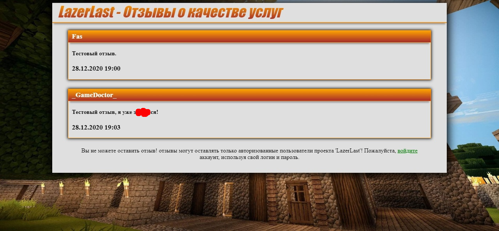
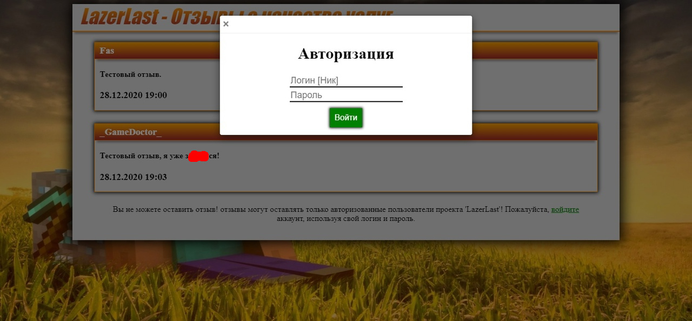

# Описание сайта с отзывами о Minecraft проекте ["LazerLast"](https://vk.com/lazerlast)

**LazerLast** - это игровой проект созданый в рамках игры "Minecraft", а именно - сервер, на котором были реализованы в период с 2019-2021 гг. различные игровые режимы (Prison, SkyBlock и др.).

---

Сайт создан для сбора мнений пользователей о проекте "LazerLast", разработан на PHP. Он предлагает потенциальным и действующим клиентам, которые уже сделали донат, возможность оценить качество предоставляемых услуг.

## Процесс оставления отзыва

1. **Авторизация** через игровой аккаунт.
2. **Заполнение формы** внизу страницы.
3. **Публикация** отзыва на странице с отзывами.

Отзывы имеют техническое ограничение по длине и не проходят модерацию.

---

# Description of website with reviews Minecraft project ["LazerLast"](https://vk.com/lazerlast)

**LazerLast** - this game project, created in within computer game "Minecraft" (game server). On him was realized in 2019-2021 years different game modes (Prison, SkyBlock and other).

---

The site is created for collecting user opinions about the "LazerLast" project, developed in PHP. It offers potential and existing clients who have already donated the opportunity to evaluate the quality of the provided services.

## Feedback Submission Process

1. **Authorization** through a gaming account.
2. **Filling out the form** at the bottom of the page.
3. **Publishing** the feedback on the feedback page.

Reviews have a technical length restriction and do not undergo moderation.

---

*screenshots/Скриншоты*
